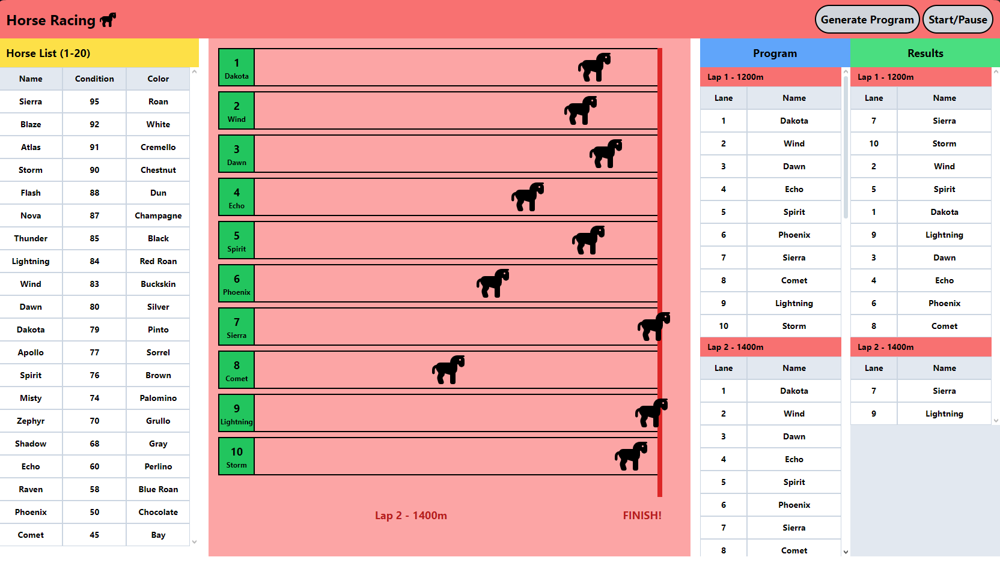

# Internship Test Case For Front-End Development

### Horse Race Game Designed \w Vue.js & Vuex.

### Case Description

- Horses with different speeds race with a small random variable changing the results each lap.
- Race consists of 6 laps.
- The "Generate Program" button is to plan a program for the race by randomly selecting 10 horses among 20 different horses.
- The "Start/Pause" button starts or pauses the race.

### Project Preview



## Project setup

```
npm install
```

### Compiles and hot-reloads for development

```
npm run serve
```

### Compiles and minifies for production

```
npm run build
```
